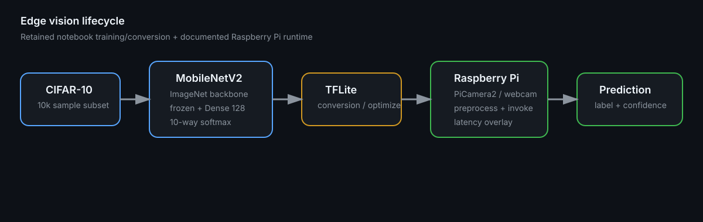

# Raspberry Pi Edge Vision — MobileNetV2 → TensorFlow Lite

[](https://github.com/syifaniads/ComputerVisionRasberryPi/actions/workflows/python-ci.yml)

An edge-computer-vision study that trains a lightweight **MobileNetV2 transfer-learning classifier on CIFAR-10**, converts the Keras model to TensorFlow Lite, and documents a Raspberry Pi camera inference path.

The original Colab notebook remains in [`Computer_Vision_Riset_Quadcopter_ROBOTIIK.ipynb`](Computer_Vision_Riset_Quadcopter_ROBOTIIK.ipynb). The additional `src/`, runtime, tests, and documentation are a later portfolio engineering pass that makes the edge-inference path easier to review without pretending every refactor existed in the original experiment.

<p align="center">
  
</p>

> **Visual provenance:** this diagram maps the actual notebook training/conversion stages and the documented Raspberry Pi inference path. The notebook itself contains retained training output and plots; this README does not fabricate hardware benchmark screenshots.

## What is actually retained

The notebook records:

- TensorFlow **2.18.0** in the Colab run;
- CIFAR-10 as the primary 10-class dataset;
- a `SAMPLE_SIZE = 10000` training subset;
- input resizing to **224×224** for MobileNetV2;
- ImageNet-pretrained `MobileNetV2(include_top=False)`;
- frozen base-model layers;
- `GlobalAveragePooling2D → Dense(128, relu) → Dense(10, softmax)` classification head;
- Adam with learning rate `0.001` and categorical cross entropy;
- retained training output where validation accuracy rises from **0.7390 in epoch 1 to 0.7855 in epoch 7**;
- TensorFlow Lite conversion;
- an additional conversion using `tf.lite.Optimize.DEFAULT`;
- export of model and class-label artifacts for transfer to Raspberry Pi.

The repository does **not** claim a final on-device FPS/latency result because a reproducible device benchmark artifact was not retained. [`docs/BENCHMARKING.md`](docs/BENCHMARKING.md) defines how that measurement should be performed.

## Model path

```text
CIFAR-10
  ↓ sample / resize 224×224
MobileNetV2 ImageNet backbone (frozen)
  ↓
GlobalAveragePooling2D
  ↓
Dense 128 / ReLU
  ↓
10-class softmax
  ↓
Keras model
  ↓ TFLiteConverter
TensorFlow Lite artifact
  ↓
Raspberry Pi + PiCamera2 / webcam
  ↓
preprocess → invoke → top class + confidence
```

`Optimize.DEFAULT` is preserved as evidence of the optimization experiment, but this portfolio does **not** label it as full-int8 quantization because no representative-dataset calibration pipeline is retained.

## Portable inference code

The core preprocessing and classification helpers are separated from camera and TFLite runtime setup:

```python
from src.vision_inference import preprocess_image, classify_output

input_tensor = preprocess_image(frame_bgr, width=224, height=224)
label, confidence, class_id = classify_output(prediction, labels)
```

This separation allows CI to test image shape, BGR→RGB conversion, normalization, and class selection without needing Raspberry Pi hardware.

## Raspberry Pi runtime

On Raspberry Pi OS, use a virtual environment that can see system packages such as PiCamera2:

```bash
bash scripts/setup_raspberry_pi.sh
source .venv/bin/activate
python runtime/raspberry_pi_camera.py \
  --model vision_model_quantized.tflite \
  --labels class_names.txt
```

The runtime attempts PiCamera2 first and can fall back to an OpenCV camera. Press `q` or `Esc` to stop.

## Tests and CI

```bash
python -m venv .venv
source .venv/bin/activate
pip install -r requirements-dev.txt
pytest -q
```

GitHub Actions verifies the hardware-independent inference helpers. It intentionally does not pretend to test PiCamera2, camera drivers, ARM TFLite binaries, or real-device latency on an x86 hosted runner.

## Senior technical review path

| Question | Inspect |
|---|---|
| What model was actually trained? | [`Computer_Vision_Riset_Quadcopter_ROBOTIIK.ipynb`](Computer_Vision_Riset_Quadcopter_ROBOTIIK.ipynb), [`docs/MODEL_CARD.md`](docs/MODEL_CARD.md) |
| How is preprocessing made testable? | [`src/vision_inference.py`](src/vision_inference.py) |
| How would the Pi camera feed the model? | [`runtime/raspberry_pi_camera.py`](runtime/raspberry_pi_camera.py) |
| How is the device prepared? | [`scripts/setup_raspberry_pi.sh`](scripts/setup_raspberry_pi.sh) |
| What benchmark is still missing? | [`docs/BENCHMARKING.md`](docs/BENCHMARKING.md) |
| What is original vs portfolio extension? | [`docs/PROVENANCE.md`](docs/PROVENANCE.md) |

## Engineering limitations

This is an edge-AI research/learning artifact, not a validated autonomous-drone perception stack. CIFAR-10 is a small image-classification benchmark and does not represent real aerial detection conditions. Classification also produces one image-level label rather than object bounding boxes. A production robotics path would require task-appropriate data, device-level profiling, thermal/power measurements, failure-mode testing, camera calibration, confidence handling, and likely detection/tracking rather than only image classification.
